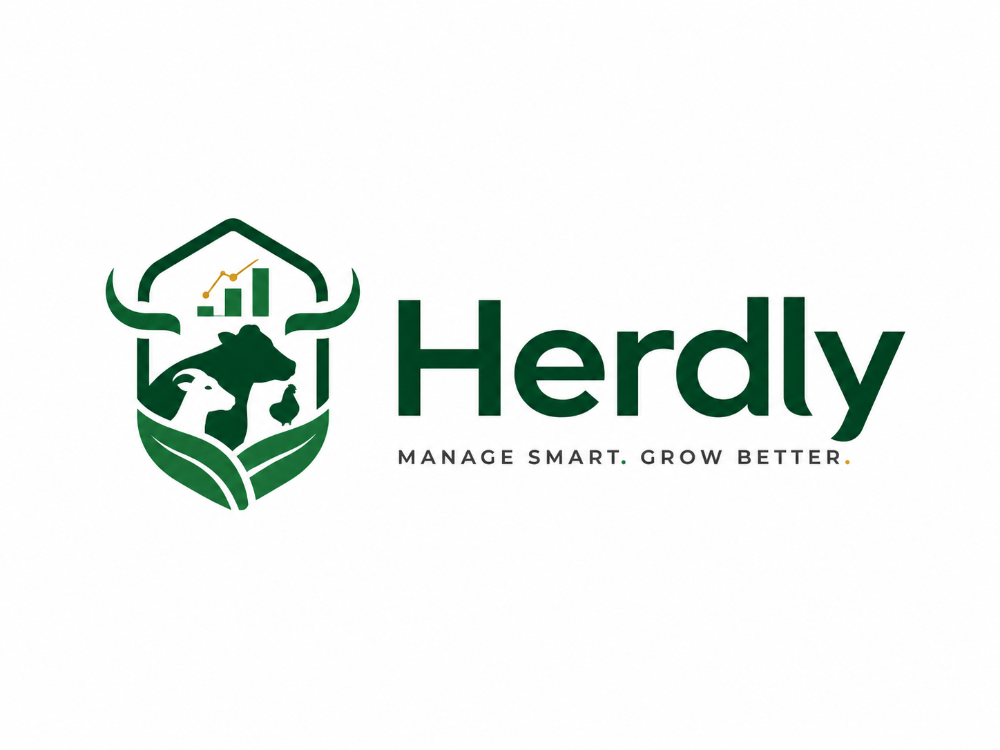

<p align="center">
  
</p>

# Herdly by RG Dev

Herdly is farm management software for Kenyan livestock farmers. It runs on your Windows PC and works **completely offline**: no internet, no online account and no monthly data costs. Your farm records stay on your own computer.

This page is where Herdly is published. **Download the latest version from [Releases](https://github.com/kenrodgers-bit/Herdly/releases/latest).**

**Latest version: 1.0.0** — [HerdlySetup-1.0.0.exe](https://github.com/kenrodgers-bit/Herdly/releases/latest/download/HerdlySetup-1.0.0.exe) · [portable](https://github.com/kenrodgers-bit/Herdly/releases/latest/download/Herdly-1.0.0-portable.exe)

## Which file do I download?

| File                           | Use it when                                                                                   |
| ------------------------------ | --------------------------------------------------------------------------------------------- |
| `HerdlySetup-<version>.exe`    | **Recommended.** Installs Herdly with a desktop and Start menu shortcut.                      |
| `Herdly-<version>-portable.exe` | You can't install software on the PC, or you want to run Herdly from a flash drive.           |

Your farm data is kept in the same place for both, so you can switch between them.

## System requirements

- Windows 10 or Windows 11, 64-bit
- 4 GB RAM or more
- About 400 MB of free disk space, plus room for your records and backups
- No internet connection needed

## Installing

1. Download `HerdlySetup-<version>.exe`.
2. Double-click it. If Windows shows **"Windows protected your PC"**, click **More info**, then **Run anyway**. This appears because the installer is not yet code-signed.
3. Follow the steps. Herdly installs for your Windows user only, so no administrator password is needed.

## Updating

- **With internet:** Herdly checks quietly for a new version a little after it starts. It never downloads an update without asking you first, so your data bundle is safe.
- **Without internet:** get the newer `HerdlySetup-<version>.exe` on a flash drive and run it. It installs over the old version.

Your farm records are **kept** when you update, reinstall or uninstall Herdly.

## Your data and backups

Herdly stores everything in this folder on your PC:

```
%APPDATA%\Herdly
```

(Paste that into the address bar of File Explorer to open it.)

- `herdly.db` holds your farm records.
- `backups\` holds a copy taken automatically each day you open Herdly, plus a copy before every update that changes how data is stored.

**Moving to a new computer:** close Herdly and copy the whole `Herdly` folder to a flash drive. On the new PC, paste it into `%APPDATA%`, then install and open Herdly.

## Support

Contact RG Dev for help. If Herdly shows an error, please include the file `logs\main.log` from the data folder above.

---

Herdly is proprietary software. © 2026 RG Dev. All rights reserved.
